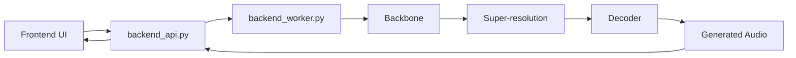

<div align="center">


# High-Fidelity Song Generation With a Unified Acoustic-Token Pipeline

English | [中文](./README_zh.md)

</div>

<div align="center">

Khala is an open-source system for high-fidelity song generation, providing a complete text-to-audio inference pipeline with a frontend interface, backend orchestration, multi-stage model inference, and reproducible runtime environments.

</div>

<div align="center">

<a href="<demo-page-link>">
  
</a>
<a href="<arxiv-link>">
  
</a>
<a href="<huggingface-model-link>">
  
</a>
<a href="./ENVIRONMENT_SETUP.md">
  
</a>
<a href="./backend/README_backend.md">
  
</a>

</div>

## ✨ What Is Khala

Khala aims to provide a complete, runnable, and extensible song generation system rather than a collection of isolated inference scripts. The system is built around a unified acoustic-token route, progressively generating coarse structure and fine acoustic detail within the same discrete audio representation space.

The current release includes:

- A Vite + React frontend for prompt, lyrics, and generation controls.
- A FastAPI-based API layer for request handling, queue management, worker scheduling, and result delivery.
- A single-GPU inference worker that loads the tokenizer, Megatron backbone, super-resolution model, and decoder to run the full audio generation pipeline.
- A runtime setup organized around NVIDIA NGC containers for reproducibility and future deployment.

The current project focuses on:

- Song-level music generation rather than short clips or loop-style accompaniment.
- Controllable generation conditioned on text descriptions and lyrics.
- Coarse-to-fine generation based on a 64-layer RVQ acoustic token hierarchy.
- A multi-stage inference pipeline built from backbone, super-resolution, and decoder stages.
- Delivering a complete runnable system instead of a standalone model script.

## 📰 News

- `[2026-04-30]` The demo page and paper page are now online.
- `[2026-04-30]` The current codebase, environment docs, and Dockerfile have been cleaned up for release.
- `[Coming Soon]` Prebuilt Docker images will be published on GHCR.
- `[Coming Soon]` More audio samples and model variants will be added.

### 🖥️ Web UI


### 🎧 Audio Samples

The full demo page is available at:

- [Listen to Khala Demos](<demo-page-link>)

## 🚀 Quick Start

The recommended startup path is:

1. Clone this repository.
2. Prepare the runtime environment.
3. Download the model checkpoints.
4. Place the model files in the expected project locations.
5. Launch the backend and frontend.

Two environment setup paths are currently supported:

- Use a prebuilt Docker image.
- Use the repository-level [Dockerfile](./Dockerfile) or the [environment setup guide](./ENVIRONMENT_SETUP.md) to prepare the environment manually.

Detailed documentation:

- Environment setup:
  - [ENVIRONMENT_SETUP.md](./ENVIRONMENT_SETUP.md)
  - [ENVIRONMENT_SETUP_zh.md](./ENVIRONMENT_SETUP_zh.md)
- Backend documentation:
  - [backend/README_backend.md](./backend/README_backend.md)
  - [backend/README_backend_zh.md](./backend/README_backend_zh.md)

## 🧠 System Overview

The current system has three layers:

- Frontend: accepts prompts, lyrics, and generation settings, and displays results.
- API dispatcher: receives requests, creates jobs, manages the queue, and dispatches work to idle workers.
- Inference worker: runs backbone, super-resolution, and decoder inference.

The request path is:



## 🔗 Project Resources

- Demo page: `<demo-page-link>`
- arXiv paper: `<arxiv-link>`
- Model weights: `<huggingface-model-link>`
- Environment setup: [ENVIRONMENT_SETUP.md](./ENVIRONMENT_SETUP.md)
- Backend docs: [backend/README_backend.md](./backend/README_backend.md)

## 🗂 Repository Structure

```text
Khala-Music-Generation/
├── backend/
├── frontend/
├── core/
├── models/
├── checkpoints/
├── assets/
├── Dockerfile
├── requirements.txt
├── ENVIRONMENT_SETUP.md
└── ENVIRONMENT_SETUP_zh.md
```

Main directories:

- `frontend/`: frontend UI and Vite project.
- `backend/`: backend API, worker, and launcher scripts.
- `core/`: project-specific core modules.
- `models/`: Megatron, decoder, and tokenizer related code.
- `checkpoints/`: model checkpoint directory.
- `assets/`: images used by the README and demo materials.

## 📚 Citation

Citation information will be added later.

## 🙏 Acknowledgements

This project builds on a number of excellent open-source projects and tools, including but not limited to:

- NVIDIA NGC
- Megatron / Megatron Core
- Hugging Face
- FastAPI
- Vite / React

## 📜 License

License information will be added later.
